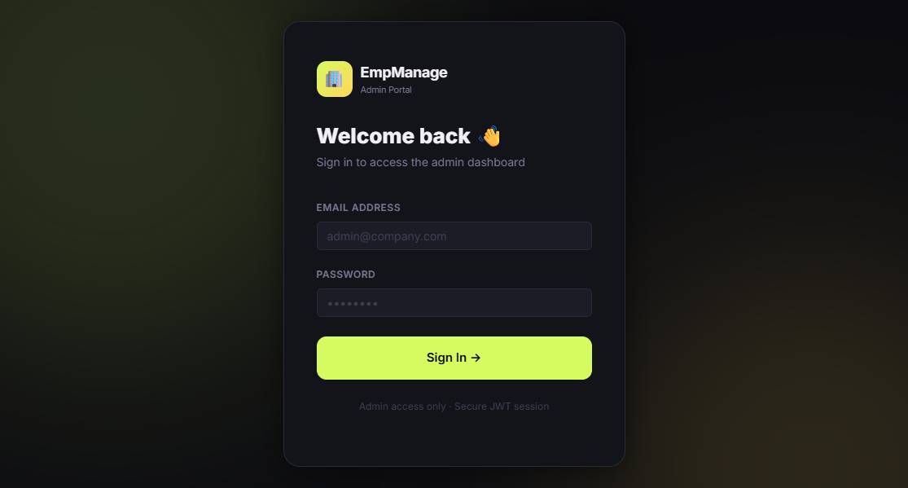
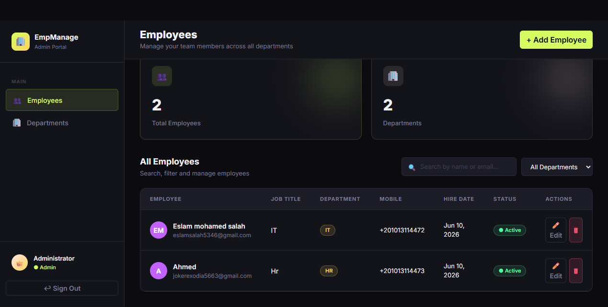
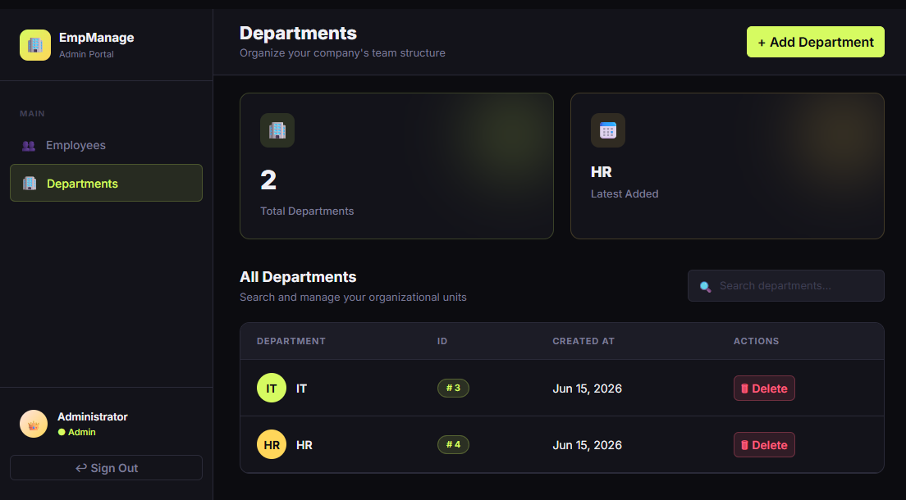

# Employee Management System

A full-featured Employee Management System built with **ASP.NET Core 10 Web API**, following Clean Architecture principles with Repository/Service pattern, JWT authentication, and a polished HTML/CSS/JS frontend.

## 🌐 Live Demo

| | URL |
|---|---|
| **Frontend** | https://employee-management-task.runasp.net/index.html |
| **Swagger UI** | https://employee-management-task.runasp.net/swagger/index.html |

### Default Admin Credentials
- **Email:** `admin@company.com`
- **Password:** `Admin@123`

---

## 🏗️ Architecture

- **Onion Architecture** (Domain → Application → Infrastructure → API)
- **Repository Pattern** with Unit of Work
- **SOLID Principles** and Clean Code practices
- **Entity Framework Core** with SQL Server
- **JWT Authentication** for secure API access

## 🛠️ Tech Stack

- **Framework:** ASP.NET Core 10.0 Web API
- **Language:** C#
- **Database:** SQL Server
- **ORM:** Entity Framework Core 10.0.9
- **Authentication:** ASP.NET Core Identity + JWT Bearer
- **Validation:** FluentValidation
- **Object Mapping:** Mapster
- **API Documentation:** Swagger/OpenAPI
- **Frontend:** HTML, CSS, JavaScript, Bootstrap 5

## 📁 Project Structure

```
EmployeeManagement/
├── EmployeeManagement.API/          # Web API Layer
│   ├── Controllers/                 # API Controllers
│   ├── Extensions/                  # Service configuration extensions
│   ├── Filters/                     # Validation action filter
│   ├── Middleware/                  # Global exception handling
│   ├── Wrappers/                    # Unified API response wrapper
│   └── wwwroot/                     # Frontend (HTML, CSS, JS)
├── EmployeeManagement.Application/  # Application Layer
│   ├── DTOs/                        # Data Transfer Objects
│   ├── Services/                    # Business logic services
│   ├── Validators/                  # FluentValidation rules
│   └── Mapping/                     # Mapster configurations
├── EmployeeManagement.Domain/       # Domain Layer (Core)
│   ├── Entities/                    # Domain entities
│   └── Interfaces/                  # Repository contracts
└── EmployeeManagement.Infrastructure/ # Infrastructure Layer
    ├── Data/                        # DbContext
    ├── Repositories/                # Repository implementations
    ├── Migrations/                  # EF Core migrations
    └── Seeding/                     # Automatic admin seeding
```

## ✨ Features

### Core Functionality
- ✅ Employee CRUD operations (Create, Read, Update, Delete)
- ✅ Department management (Create, Read, Delete)
- ✅ Search employees by name or filter by department
- ✅ Employee status tracking (Active/Inactive)
- ✅ Admin authentication with JWT tokens

### Employee Fields
- Employee ID (Auto-generated)
- Full Name
- Email
- Mobile Number
- Department (Foreign Key)
- Job Title
- Hire Date
- Is Active (Boolean)

### Technical Features
- ✅ Global exception handling with user-friendly error messages
- ✅ Unified API response format `{ success, message, data, errors }`
- ✅ FluentValidation for input validation
- ✅ JWT-based authentication
- ✅ Role-based authorization (Admin)
- ✅ CORS enabled for frontend integration
- ✅ Swagger UI with JWT support (available in all environments)
- ✅ EF Core database migrations
- ✅ Automatic admin role and user seeding on startup

---

## 🚀 Getting Started

### Prerequisites
- [.NET 10 SDK](https://dotnet.microsoft.com/download/dotnet/10.0)
- SQL Server (LocalDB or Express)
- Visual Studio 2022 / VS Code / Rider

### Installation Steps

1. **Clone the repository**
   ```bash
   git clone https://github.com/eslamsalah5/EmployeeManagement.git
   cd EmployeeManagement
   ```

2. **Update connection string**

   Edit `EmployeeManagement.API/appsettings.json`:
   ```json
   "ConnectionStrings": {
     "DefaultConnection": "Server=(localdb)\\mssqllocaldb;Database=EmployeeManagementDB;Trusted_Connection=true;TrustServerCertificate=true;"
   }
   ```

3. **Run database migrations**
   ```bash
   dotnet ef database update --project EmployeeManagement.Infrastructure --startup-project EmployeeManagement.API
   ```

4. **Build and run the application**
   ```bash
   dotnet build
   dotnet run --project EmployeeManagement.API
   ```

5. **Access the application**
   - Frontend: `https://localhost:PORT/index.html`
   - Swagger UI: `https://localhost:PORT/swagger`

> The admin user (`admin@company.com` / `Admin@123`) is created automatically on first run.

---

## 📝 API Endpoints

### Authentication
- `POST /api/auth/login` — Admin login (returns JWT token)

### Departments
- `GET /api/departments` — Get all departments
- `GET /api/departments/{id}` — Get department by ID
- `POST /api/departments` — Create new department 🔒
- `DELETE /api/departments/{id}` — Delete department 🔒

### Employees
- `GET /api/employees` — Get all employees (supports search & filter)
  - Query params: `?search=name&departmentId=1`
- `GET /api/employees/{id}` — Get employee by ID
- `POST /api/employees` — Create new employee 🔒
- `PUT /api/employees/{id}` — Update employee 🔒
- `DELETE /api/employees/{id}` — Delete employee 🔒

🔒 = Requires JWT token with Admin role

## 🧪 Testing with Swagger

1. Navigate to `/swagger`
2. Use `POST /api/auth/login` with the admin credentials
3. Copy the returned `token`
4. Click **Authorize** (top right) and enter: `Bearer {your-token}`
5. All protected endpoints are now accessible

---

## 📦 NuGet Packages

| Package | Version | Purpose |
|---------|---------|---------|
| Microsoft.EntityFrameworkCore.SqlServer | 10.0.9 | SQL Server provider |
| Microsoft.EntityFrameworkCore.Tools | 10.0.9 | Migrations |
| Microsoft.AspNetCore.Identity.EntityFrameworkCore | 10.0.9 | Identity system |
| Microsoft.AspNetCore.Authentication.JwtBearer | 10.0.9 | JWT auth |
| Swashbuckle.AspNetCore | 10.2.1 | Swagger/OpenAPI |
| Mapster | 7.4.0 | Object mapping |
| FluentValidation.DependencyInjectionExtensions | 12.1.1 | Validation |

---

## 📸 Screenshots

### Login Page


### Employees Page


### Add / Edit Employee
.png)

### Departments Page


---

## 🎯 Project Highlights

- **Clean Architecture:** Proper separation of concerns with clear layer boundaries
- **SOLID Principles:** Applied throughout the codebase
- **Repository + UoW Pattern:** Abstracted data access with proper encapsulation
- **Global Error Handling:** Consistent, user-friendly error responses across all endpoints
- **Security:** JWT authentication with role-based authorization
- **Validation:** Comprehensive input validation using FluentValidation
- **API Documentation:** Full Swagger documentation with JWT authentication support

---

## 👨‍💻 Development Notes

### Code Standards
- KISS (Keep It Simple, Stupid)
- DRY (Don't Repeat Yourself)
- YAGNI (You Aren't Gonna Need It)
- Clean Code principles with meaningful naming conventions

### Commit Convention
- `init:` — Initial setup
- `feat:` — New features
- `fix:` — Bug fixes
- `chore:` — Maintenance tasks
- `docs:` — Documentation updates

---

## 📄 License

This project is created as a technical assessment for AI Makers.

## 👤 Author

**Eslam Mohamed Salah eldeen Mahmoud**

---

**Status:** ✅ Complete
